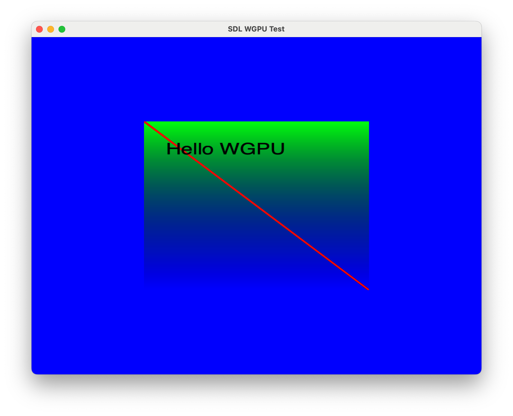

# Swift WGPU HelloWorld

This project demonstrates how to use WGPU in an SDL2 window from Swift. 

It works on macOS and Linux. 

The WGPU backend works on macOS with Metal and on Linux with Vulkan.

The WGPU backend is imported from [SwiftWgpuTools](https://github.com/optimisme/SwiftWgpuTools/tree/main)

```swift
  // Set binaries path for library linking
  let wgpuBasePath = ".build/checkouts/SwiftWgpuTools/Sources/Libs/Wgpu/"
  
  // ... See example 'Package.swift' for more details ...

  // Set 'SwfitWgpuTools' as a dependency
  dependencies: [
      .package(url: "https://github.com/optimisme/SwiftWgpuTools.git", branch:"main")
  ],
```

And to use it:
```swift
import SwiftWgpuTools
```

## Install dependencies

### macOS
```bash
brew install cairo sdl2
```

### Linux
```bash
sudo apt-get install \
  libx11-dev \
  libcairo2-dev \
  libsdl2-dev \
  libvulkan-dev \
  libvulkan1
```

## How to run the example

Simple triangle (WgpuTriangle):
```bash
./buildTriangle.sh
```

Two triangles filled with one texture from a Cairo drawing (WgpuCairo):
```bash
./buildCairo.sh
```

## About WGPU binaries

WGPU has a 'Mozilla Public License Version 2.0,' which requires including the original code or an easy way to access the original code. The binaries distributed by this project are from the official project:

WGPU GitHub project

WGPU binaries are found in the WGPU folder and have been downloaded from:

WGPU v0.19.4.1

## Screen capture of WgpuCairo


